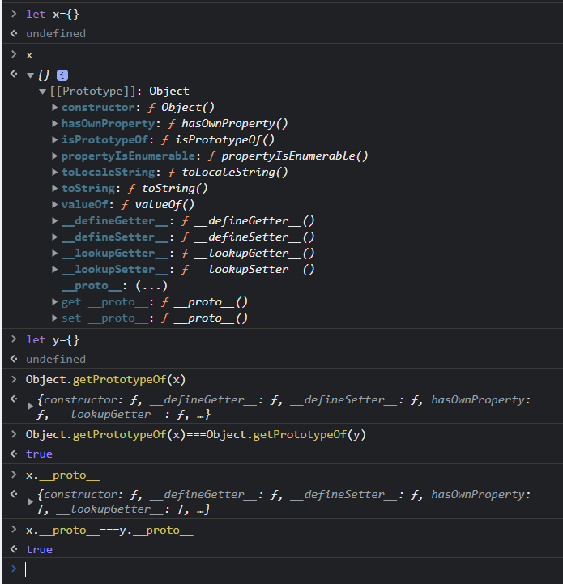

> didn't understand this [video](https://codewithmosh.com/courses/javascript-basics-for-beginners/lectures/5088081)    
>> - how to make a function using "**new Function();**" constructor.  
>> - how the ***call*** method works?

> - toFixed, round  
> - string.split(), string.trim()
> - Math, Date APIs
> - splice method in strings and arrays

>every object has a prototype except the root object  
>> here are some tryouts:
>> 

